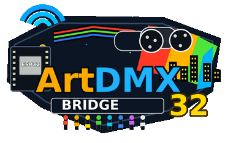

<p align="center">
  
</p>

# artdmx-bridge32

<p align="center"><strong>Art-Net to DMX512 Gateway for ESP32</strong></p>

<p align="center">
  <a href="#"></a>
  <a href="#"></a>
  <a href="#"></a>
  <a href="LICENSE"></a>
</p>

<p align="center">
  <a href="manual.pdf">Manual (EN)</a>
  &nbsp;·&nbsp;
  <a href="manual-de.pdf">Handbuch (DE)</a>
</p>

Sources: `docs/manual.html` (English) · `docs/manual-de.html` (German). Regenerate PDFs: `docs/generate_manual_pdf.ps1` and `docs/generate_manual-de_pdf.ps1` (requires [wkhtmltopdf](https://wkhtmltopdf.org/)).

---

ESP32 Art-Net to DMX512 bridge for Arduino IDE projects. It receives DMX data over WiFi, drives one or two RS-485 DMX outputs, and can optionally use a wired DMX input as fallback when Art-Net traffic is idle.

Runtime settings are stored in NVS flash and can be edited through the built-in web interface.

> [!NOTE]
> This project is inspired by [Connotron DMX Gateway](https://github.com/chaosloth/Connotron_DMX_Gateway) by [Christopher Connolly](https://github.com/chaosloth). `artdmx-bridge32` is a separate rewrite with NVS-backed configuration, a modular codebase, dual DMX output support, traffic indicators, a web dashboard, DMX test mode, configuration backup/restore, and a dual-core FreeRTOS task layout.

## Table of contents

- [Features](#features)
- [Hardware](#hardware)
- [Pinout](#pinout)
- [Software requirements](#software-requirements)
- [Quick start](#quick-start)
- [Web interface](#web-interface)
  - [Dashboard](#dashboard)
  - [Configuration page](#configuration-page)
  - [Web login](#web-login)
  - [DMX test mode](#dmx-test-mode)
  - [Serial Monitor](#serial-monitor)
- [Configuration](#configuration)
  - [Configuration backup and restore](#configuration-backup-and-restore)
  - [Channel filter](#channel-filter)
  - [Hostname and DHCP](#hostname-and-dhcp)
- [OTA updates](#ota-updates)
- [Architecture](#architecture)
- [esp_dmx patch for ESP32 core 3.3.x](#esp_dmx-patch-for-esp32-core-33x)
- [Troubleshooting](#troubleshooting)
- [User functions checklist](#user-functions-checklist)
- [Project structure](#project-structure)
- [Contributing](#contributing)
- [License](#license)
- [Acknowledgments](#acknowledgments)

## Features

- **Art-Net input** over WiFi
- **DMX1 output** for the main DMX512 line
- **Optional DMX2 output** on a second RS-485 line (shared UART, GPIO pin switching)
- **Optional wired DMX1 input fallback** when Art-Net traffic times out
- **Channel filter** for port 2: limits the channel range and avoids re-sending unchanged data to legacy fixtures on DMX2
- **Web dashboard** with live status, DMX traffic indicators, DMX test mode banner, and auto-scrolling log
- **Web configuration** for WiFi, hostname, Art-Net, DMX timing, input mode, debug settings, and factory reset
- **Localized configuration page** — English or German UI (autodetect, or fixed language); Dashboard and DMX Test remain English
- **Configuration backup / restore** — download and upload all NVS settings as an editable `.conf` text file
- **DMX test page** — manual DMX output with 16 sliders; Art-Net ignored while test mode is on
- **Site logo and hostname** on all web pages
- **Art-Net debug logging** with configurable channel range, packet sampling, and log-on-change-only
- **NVS persistence** for runtime settings
- **Config access point** when WiFi is unavailable
- **ArduinoOTA** firmware updates over WiFi
- **Dual-core FreeRTOS layout**: network services on core 0, DMX timing on core 1
- **Queue-based Art-Net to DMX handoff** so packet callbacks do not block DMX transmission
- **mDNS** — `http://<hostname>.local` on the LAN
- **WiFi auto-reconnect** with link health checks; setup access point if STA fails within 5 seconds
- **Setup AP** — configure WiFi from the web UI when the device cannot join your network
- **Status LED (GPIO 22)** — WiFi/OTA/test-mode patterns (PWM breathing in DMX test mode)
- **Physical traffic LEDs (GPIO 13/14)** — brief flash on DMX packet activity
- **Serial Monitor log** at 115200 baud (same messages as the dashboard log)
- **Web reboot** — reboot without saving, or save then reboot from Configuration

## Hardware

| Component | Description |
| --- | --- |
| ESP32 dev board | Any common ESP32 board, for example ESP32-WROOM-32 / ESP32-WROOM-DA |
| MAX485 or compatible RS-485 transceiver | One transceiver for DMX1 output, optional second transceiver for port 2 |
| Traffic LEDs | Optional LEDs for DMX1 and DMX2/input activity |
| Factory reset button/jumper | GPIO 15 to GND, held LOW for 3 seconds |
| 5 V / 3.3 V supply | ESP32 logic supply; DMX line wiring remains separate |

> [!IMPORTANT]
> Port 2 is used either as **DMX2 output** or as **DMX1 wired input**, never both. Select the mode in the web UI and reboot.

> [!NOTE]
> **DMX2 output** reuses the same `esp_dmx` driver as DMX1 (`DMX_NUM_1`) and switches UART pins each frame — no second driver install is required. **DMX1 wired input** uses `DMX_NUM_2` on the same GPIOs and may need the [esp_dmx UART2 patch](#esp_dmx-patch-for-esp32-core-33x).

## Pinout

Pin assignments are defined in `config.cpp`. Change them there if your hardware uses different GPIOs.

### DMX ports

| Port | Role | ESP32 GPIOs TX / RX / EN |
| --- | --- | --- |
| DMX1 output | Art-Net to fixtures, always active | `17 / 16 / 4` |
| DMX2 output | Filtered Art-Net mirror when DMX2 output is enabled | `19 / 18 / 21` |
| DMX1 input | Wired fallback when input mode is enabled (`DMX_NUM_2`) | `19 / 18 / 21` |

### DMX1 output wiring

| ESP32 GPIO | MAX485 pin | Function |
| --- | --- | --- |
| GPIO 17 | DI | UART TX to DMX data |
| GPIO 16 | RO | UART RX |
| GPIO 4 | DE + /RE | Driver enable, tied together |
| GND | GND | Common ground |
| — | A / B | DMX+ / DMX− to fixtures |

### Second port wiring

Wire the second MAX485 to GPIO 19, GPIO 18, and GPIO 21.

| ESP32 GPIO | MAX485 pin | Function |
| --- | --- | --- |
| GPIO 19 | DI | TX for DMX2 output |
| GPIO 18 | RO | RX for wired DMX1 input |
| GPIO 21 | DE + /RE | Driver enable, tied together |
| GND | GND | Common ground |
| — | A / B | DMX+ / DMX− line |

### LEDs and reset

| GPIO | Function |
| --- | --- |
| GPIO 13 | DMX1 output activity LED |
| GPIO 14 | DMX2 output activity LED, or DMX1 input activity LED when input mode is enabled |
| GPIO 22 | WiFi status LED — steady = connected, single blink = connecting, double blink = setup AP, triple blink = OTA, **breathing** = DMX test mode |
| GPIO 15 | Factory reset input, active LOW for 3 seconds (or use **Factory reset** on the config page) |

LEDs are optional. Connect each through a series resistor (for example 330 Ω–1 kΩ). GPIO **13** and **14** light for ~150 ms per DMX packet; GPIO **22** uses PWM for breathing in DMX test mode.

The web dashboard shows **Traffic** for about 2 seconds after the last Art-Net packet (DMX1/DMX2 out) or wired input activity. Periodic DMX refresh alone does not keep the indicator active.

## Software requirements

Install the required libraries through the Arduino Library Manager or from their GitHub repositories.

| Requirement | Notes |
| --- | --- |
| [esp_dmx](https://github.com/someweisguy/esp_dmx) 4.x | DMX512 driver for ESP32 |
| [ArtnetWifi](https://github.com/rstephan/ArtnetWifi) | Art-Net over WiFi |
| ArduinoOTA | Included with the ESP32 Arduino core |
| WiFi / WebServer / Preferences | Included with the ESP32 Arduino core |

Recommended Arduino board settings:

| Setting | Value |
| --- | --- |
| Board | ESP32 Dev Module or your exact ESP32 board (e.g. ESP32 WROOM DA) |
| ESP32 Arduino core | 2.x or 3.x (3.3.10 tested) |
| Serial Monitor | 115200 baud |

> [!WARNING]
> ESP32 Arduino core 3.3.x may require an `esp_dmx` patch. See [esp_dmx patch for ESP32 core 3.3.x](#esp_dmx-patch-for-esp32-core-33x).

## Quick start

### 1. Clone the repository

```bash
git clone https://github.com/RichardSmetana/artdmx-bridge32.git
cd artdmx-bridge32
```

### 2. Create local secrets

Copy the example file:

```bash
cp secrets.h.example secrets.h
```

Edit `secrets.h`:

```cpp
#define SECRETS_WIFI_SSID     "MyNetwork"
#define SECRETS_WIFI_PASS     "MyPassword"
#define SECRETS_OTA_PASSWORD  "MyOtaPassword"
```

> [!IMPORTANT]
> `secrets.h` contains credentials. Keep it local and do not commit it to Git. The file should stay listed in `.gitignore`.

### 3. Patch esp_dmx if needed

If compilation fails with `uart_periph_signal[...].module` errors on ESP32 core 3.3.x, apply the patch described in [esp_dmx patch for ESP32 core 3.3.x](#esp_dmx-patch-for-esp32-core-33x).

### 4. Upload the firmware

1. Open `artdmx-bridge32.ino` in the Arduino IDE.
2. Select your ESP32 board.
3. Select the serial port.
4. Upload the sketch.

After a successful boot, the Serial Monitor shows the project name, firmware version, copyright line, and WiFi state. Look for:

```text
artdmx-bridge32 2.3.0-web-dmx starting...
Copyright (C) 2026 Richard Smetana
Licensed under GNU GPL v3 or later
DMX test mode off (default after boot)
DHCP client hostname: artdmx-bridge32
```

That name is sent to your router in the DHCP request (option 12) and should appear in the router’s client list.

### 5. Open the web UI

Use one of these URLs:

```text
http://artdmx-bridge32.local
http://<device-ip>
```

If WiFi is unavailable for **5 seconds**, the device starts a setup access point. Connect to `<hostname>-setup`, open the AP IP in a browser (shown in the Serial log and dashboard banner), and set WiFi credentials on the **Configuration** page. The setup AP has **no Wi-Fi password** by design — set a **Web password** in Configuration if you need to protect the UI on untrusted networks. While connected to your network, link health is rechecked every **2 seconds** (valid IP + AP association). If the signal or link is lost, the device reconnects automatically and the status LED single-blinks until connected again or AP mode starts.

| Field | Default |
| --- | --- |
| SSID | `artdmx-bridge32-setup` or `<hostname>-setup` |
| Web UI | AP IP shown in Serial Monitor or dashboard banner |

### 6. Send Art-Net

Configure your lighting software to send Art-Net to the ESP32 IP address.

The Art-Net universe must match the universe configured in the web UI. The default universe is `0`.

## Web interface

| Page | URL | Description |
| --- | --- | --- |
| Dashboard | `/` | Live status, DMX traffic dots, Art-Net state, DMX test mode banner, and rolling log |
| Configuration | `/config` | Runtime settings editor, backup/restore, factory reset; English or German UI |
| DMX Test | `/dmx-test` | Manual DMX output with sliders (see [DMX test mode](#dmx-test-mode)) |
| Logo | `/artdmx-bridge32-logo.png` | Header image on all pages |

All pages share a **navigation bar** (Dashboard · Config · DMX Test), centered **logo**, **hostname** header, and **copyright** footer.

### Dashboard

Refreshes every **500 ms**. Available without extra software beyond a browser.

| Area | What it shows |
| --- | --- |
| **Setup banner** | Orange banner in AP mode with setup SSID and URL |
| **DMX test banner** | Purple banner when [DMX test mode](#dmx-test-mode) is active |
| **DMX traffic** | Web indicators for DMX1 out, DMX2 out (if enabled), DMX1 in (if enabled) — active ~2 s after last packet |
| **Status grid** | Hostname, URL, IP, RSSI, uptime, free heap, OTA ready, Art-Net state, DMX test, universe, DMX refresh, DMX1 input, DMX2 output, channel filter |
| **Serial log** | Rolling log (32 lines); auto-scrolls unless you scroll up |

### Configuration page

| Action | Description |
| --- | --- |
| **Save** | Write settings to NVS (some changes need reboot — see hint on page) |
| **Save and Reboot** | Save, then restart |
| **Reboot** | Restart without changing settings |
| **Download .conf** | Export NVS settings as text — see [Configuration backup and restore](#configuration-backup-and-restore) |
| **Upload / Upload and Reboot** | Import `.conf` file or pasted text |
| **Factory reset** | Erase NVS and reboot to defaults (confirmation dialog) |

Settings are grouped: **Device** (interface language, hostname, web password), **WiFi**, **OTA**, **ArtNet / DMX**, **Backup / restore**, **Danger zone**.

#### Interface language

The **Configuration** page (`/config`) can be shown in **English** or **German**. Set **Interface language** in the **Device** section:

| Value | Mode | Behavior |
| --- | --- | --- |
| `Autodetect` (default) | `ui_lang=0` | Uses the browser language (`de*` → German, otherwise English) |
| `English` | `ui_lang=1` | Always English |
| `German` | `ui_lang=2` | Always German |

Changing the language updates labels, buttons, and hints on the config page immediately. Click **Save** to store the preference in NVS. **Dashboard** and **DMX Test** stay in English. API error messages from the device remain in English.

### API endpoints

| Method | Path | Description |
| --- | --- | --- |
| GET | `/api/status` | JSON status with traffic, Art-Net, DMX test mode, and configuration summary |
| GET | `/api/log` | Rolling text log (`seq` + `lines`) |
| GET | `/api/config` | Full configuration as JSON |
| POST | `/api/config` | Save configuration (`application/x-www-form-urlencoded`); optional `reboot=1` |
| GET | `/api/config/download` | Download all NVS settings as `artdmx-bridge32.conf` |
| POST | `/api/config/upload` | Upload `.conf` text (`Content-Type: text/plain`); optional `?reboot=1`; invalid files are rejected |
| POST | `/api/reboot` | Reboot the device |
| POST | `/api/factory-reset` | Erase NVS and reboot |
| GET | `/api/dmx-test` | DMX test state (`?init=1` imports sliders from last Art-Net frame; `?sync=1` for live sync) |
| POST | `/api/dmx-test` | Update test mode, sliders, start channel, send mode |
| GET | `/api/dmx-buffer` | Full DMX test buffer dump (text) |

### Web login

**All web pages** (Dashboard, Configuration, DMX Test, logo) use **HTTP basic authentication** only when a **Web password** is set in Configuration.

| Field | Value |
| --- | --- |
| **Username** | The device **hostname** (default: `artdmx-bridge32`) |
| **Password** | The **Web password** from Configuration (not the WiFi or OTA password) |

If **Web password** is left empty, no login is required.

**Example** (default hostname, web password `my-secret`):

```text
URL:      http://artdmx-bridge32.local
Username: artdmx-bridge32
Password: my-secret
```

Changing the **Hostname** on the Configuration page also changes the web login username (reboot recommended). The config field is labeled *Hostname (mDNS, OTA, web login name)*.

> [!NOTE]
> WiFi password and OTA password are separate. They are not used for the web UI login.

### Traffic indicators

| Indicator | Visible when | Meaning |
| --- | --- | --- |
| DMX1 output | Always | Main DMX output; active on Art-Net packets |
| DMX2 output | DMX2 output enabled | Port 2 send when filtered channels change |
| DMX1 input | DMX1 input enabled | Wired input activity on port 2 |

The dashboard shows a **purple banner** and **DMX test: Active** when [DMX test mode](#dmx-test-mode) is on. Art-Net status reads **Ignored** while test mode is active.

Physical **GPIO 13 / 14** LEDs flash for ~150 ms on each DMX output/input packet (disabled during OTA).

### DMX test mode

Open **DMX Test** (`/dmx-test`) to drive DMX1 manually for bench testing.

| Option | Description |
| --- | --- |
| **DMX test mode** | When on, Art-Net is ignored and slider values are sent to DMX1. Shown on the dashboard. Status LED (GPIO 22) **breathes**. |
| **Send DMX only when a slider is moved** | When checked (default), DMX updates only on slider changes. Uncheck for continuous refresh at the configured DMX interval. |
| **Update sliders from Art-Net when test mode is off** | Polls incoming Art-Net every 500 ms and mirrors values on the page sliders (display only; does not affect DMX output). |
| **Start channel** | First of **16** consecutive channels controlled by the sliders (1–497). |
| **Sliders** | 16 range controls (0–255); on page load, values are imported from the last Art-Net frame (`?init=1`). |
| **Slider range buffer** | Read-only dump of the 16 slider channels |
| **Full DMX buffer** | Read-only dump of channels 1–512 (`GET /api/dmx-buffer`) |
| **Refresh buffer dump** | Updates the full-buffer text area |

> [!NOTE]
> DMX test mode and its checkboxes (**send on slider move**, **live slider sync**) are **runtime only** — they are **off after every boot** (`dmxTestInit()`). They are not stored in NVS.

### Serial Monitor

Open the Arduino Serial Monitor at **115200 baud** to see the same rolling log as the dashboard (boot messages, WiFi, Art-Net debug lines, config save/import, OTA, DMX test on/off). OTA upload progress is shown on Serial only (`OTA progress: …`).

## Configuration

Runtime configuration is stored in NVS under the Preferences namespace `artdmx-bridge32`.

### Web-configurable settings

| Setting | Default | Notes |
| --- | --- | --- |
| WiFi SSID / password | from `secrets.h` | Reboot recommended after changing |
| Interface language | Autodetect | Config page only: `0` = autodetect, `1` = English, `2` = German |
| Hostname | `artdmx-bridge32` | mDNS, OTA, DHCP client name, and web login username — see [Hostname and DHCP](#hostname-and-dhcp) |
| OTA password | from `secrets.h` | Empty value disables OTA password protection |
| Web password | empty | When set, protects the web UI; username = hostname — see [Web login](#web-login) |
| Art-Net universe | `0` | Must match the sender |
| Art-Net timeout | `15000 ms` | Time without Art-Net before wired fallback can take over |
| DMX refresh interval | `30 ms` | Re-send interval for hold-style dimmers |
| Send full 512-channel packet | on | Off sends only channels up to the active range |
| Enable DMX2 output | off | Filtered Art-Net to port 2; reboot required |
| Enable DMX1 wired input | off | Disables DMX2 output; uses `DMX_NUM_2`; reboot required |
| Channel filter start/end | `1` to `512` | Port 2 channel range; on DMX2, send only when values in range change — see [Channel filter](#channel-filter) |
| Art-Net console log | off | Which packets to log — see below |
| Debug log channel start/end | `1`–`4` | DMX channels shown in console log (e.g. `3`–`7`) |
| Log every Nth packet | `1` | `1` = every packet; use `10`/`100` to reduce log spam |
| Log only when debug channel values change | off | Skips identical consecutive frames in the log |

**Art-Net console log** (Configuration page) controls what appears in the dashboard log and Serial Monitor. **Debug log channel start/end** is separate from the DMX port channel filter — set it to the channels you want to see (for example `3`–`7` logs `ch3-7: 255 128 0 64 255 0`).

| Mode | Logs |
| --- | --- |
| Off | No Art-Net packet lines |
| Matching universe only | Packets for the configured Art-Net universe |
| Other universes only | Packets for other universes (ignored traffic) |
| All universes | Both matched and ignored |

Combine with **Log every Nth packet** to sample traffic (for example every 10th frame).

### Factory reset

- **Web UI:** Configuration → **Danger zone** → **Factory reset** (confirmation dialog).
- **GPIO 15:** Hold LOW for 3 seconds.

Both methods erase NVS and reboot with defaults from `config.h` / `secrets.h`.

### Configuration backup and restore

On the Configuration page, **Backup / restore** lets you export and import all permanent NVS settings as a plain-text file (`artdmx-bridge32.conf`). Edit the file in any text editor, then upload it again.

**Download:** `GET /api/config/download` or **Download .conf** on the Config page.

**Upload:** paste or choose a file, then **Upload** or **Upload and Reboot**. Use `POST /api/config/upload` with `Content-Type: text/plain`.

Format: `key=value` lines, `#` comments, booleans as `true`/`false`. Quote values that contain spaces: `wifi_pass="my secret"`. All **setting** keys in the downloaded file are required on upload; optional metadata keys are `format_version`, `device`, `firmware`, and `ui_lang` (if omitted on upload, the current interface language is kept).

Upload is validated before any change is applied. Syntax errors, unknown keys, duplicate keys, missing keys, or out-of-range values return an error and **leave existing settings unchanged**.

Example:

```ini
# artdmx-bridge32 configuration
format_version=1

wifi_ssid=MyNetwork
wifi_pass=secret
hostname=artdmx-bridge32
web_password=
ota_password=
artnet_universe=0
artnet_timeout_ms=15000
dmx_refresh_ms=30
send_full_packet=true
enable_dmx_input=false
enable_dmx2_output=false
dmx2_filter_start=1
dmx2_filter_end=512
artnet_debug_mode=0
artnet_debug_every=1
artnet_debug_ch_start=1
artnet_debug_ch_end=4
artnet_debug_on_change=false
ui_lang=0
```

### Channel filter

The **channel filter start/end** settings (web UI) apply to port 2 in both modes.

#### Why use the channel filter?

Many **older DMX fixtures flicker or strobe** when they receive DMX frames continuously — even if the channel values did not change. That is common on legacy dimmers and scanners that re-process every packet on the wire.

Use this setup to run **modern fixtures on DMX1** and **older fixtures on DMX2** in a fixed channel range:

1. Connect new fixtures to **DMX1 output** (full Art-Net stream, normal refresh).
2. Enable **DMX2 output** and connect old fixtures to **DMX2** (GPIO 19/18/21).
3. Set the **channel filter** to the DMX addresses used by those old fixtures (for example `31`–`63`).

DMX2 then sends **only when a value in that range actually changes**. Unchanged refresh cycles are not repeated on DMX2, so legacy fixtures are not fed redundant frames and are much less likely to flicker.

> [!TIP]
> Set the filter to the exact channel block your old fixtures use. Changes on other universes/channels (for example only channel 10 on DMX1) do not trigger a DMX2 send.

| Mode | Filter behavior |
| --- | --- |
| **DMX2 output** | Only channels inside the range are sent on DMX2 (others are zero). DMX2 transmits **only when at least one value in that range changes** — refresh cycles skip DMX2 if the filtered channels are unchanged. DMX1 always receives the full Art-Net frame. |
| **DMX1 wired input** | When Art-Net is idle, wired DMX on port 2 is read; only channels inside the range are forwarded to **DMX1 output** (others zeroed). |

**Example:** filter `31`–`63`, DMX2 output enabled:

- Channel 50 changes → DMX2 sends (channels 31–63 in the packet, rest zero)
- Only channel 10 changes → DMX2 does **not** send
- Channels 31–63 unchanged on refresh → DMX2 is not sent again

Default filter `1`–`512` means DMX2 reacts to any channel change in the full universe.

### Hostname and DHCP

The **Hostname** field in Configuration (`cfg.hostname`, max 31 characters) is used in several places:

| Use | Example (default) |
| --- | --- |
| **DHCP client hostname** | Sent to the router when obtaining an IP (`artdmx-bridge32`) |
| **mDNS** | `http://artdmx-bridge32.local` |
| **ArduinoOTA** | Network port name in the IDE |
| **Art-Net node name** | Short name passed to `artnet.begin()` |
| **Web login username** | When a web password is set — see [Web login](#web-login) |
| **Setup access point SSID** | `artdmx-bridge32-setup` |

The firmware resets WiFi (`WIFI_MODE_NULL`), calls `WiFi.setHostname(cfg.hostname)` **before** `WiFi.mode()` / `WiFi.begin()`, and sets the STA netif hostname on `STA_START` via `esp_netif_set_hostname()`. That combination is required on ESP32 Arduino — calling `setHostname()` only after `WiFi.mode()` leaves the default `esp32-<MAC>` name in DHCP option 12. Your router’s lease should show `client-hostname "artdmx-bridge32"` (or your configured name), not `esp32-6A85F0`.

> [!NOTE]
> Some routers show the hostname only after the first successful DHCP lease, or cache an old name until the lease is renewed. Reboot the ESP32 or renew DHCP after changing the hostname in Configuration.

### `secrets.h`

`secrets.h` is used only for first-boot defaults.

| Macro | Description |
| --- | --- |
| `SECRETS_WIFI_SSID` | Default WiFi network name |
| `SECRETS_WIFI_PASS` | Default WiFi password |
| `SECRETS_OTA_PASSWORD` | Default OTA password; empty string disables protection |

After the first save through the web UI, values live in NVS. Editing `secrets.h` alone does not change a device with stored configuration. Use factory reset to return to defaults.

### `config.h`

| Symbol | Default | Description |
| --- | --- | --- |
| `DEVICE_NAME` | `artdmx-bridge32` | Firmware identity string |
| `VERSION` | `2.3.0-web-dmx` | Firmware version string |
| `COPYRIGHT_LINE` | `Copyright (C) 2026 Richard Smetana` | Boot log and web footer (`copyright.h`) |
| `LICENSE_LINE` | `Licensed under GNU GPL v3 or later` | Boot log and web footer |
| `SPDX_LICENSE_ID` | `GPL-3.0-or-later` | SPDX license identifier |
| `DEFAULT_HOSTNAME` | `artdmx-bridge32` | First-boot hostname |
| `DEFAULT_ARTNET_UNIVERSE` | `0` | First-boot Art-Net universe |
| `DEFAULT_ARTNET_TIMEOUT_MS` | `15000` | Art-Net idle timeout |
| `DEFAULT_DMX_REFRESH_MS` | `30` | DMX re-send period |
| `DEFAULT_SEND_FULL_PACKET` | `1` | Send full 512-slot frames |
| `DEFAULT_ENABLE_DMX_INPUT` | `0` | DMX1 wired input disabled at first boot |
| `DEFAULT_ENABLE_DMX2_OUTPUT` | `0` | DMX2 output disabled at first boot |
| `DEFAULT_DMX2_FILTER_START/END` | `1 / 512` | Channel filter for port 2 (DMX2 out / DMX1 in) |
| `DEFAULT_ARTNET_DEBUG_MODE` | `0` | Art-Net console log off |
| `DEFAULT_ARTNET_DEBUG_EVERY` | `1` | Log every packet when debug mode ≠ off |
| `DEFAULT_ARTNET_DEBUG_CH_START/END` | `1 / 4` | Default debug log channel range |
| `DEFAULT_ARTNET_DEBUG_ON_CHANGE` | `0` | Log all matching packets (not change-only) |

### `config.cpp`

| Symbol | GPIO | Description |
| --- | --- | --- |
| `LED_DMX1_PIN` | 13 | DMX1 output traffic LED |
| `LED_DMX2_PIN` | 14 | DMX2 output / DMX1 input traffic LED |
| `LED_STATUS_PIN` | 22 | WiFi status LED |
| `RESET_PIN` | 15 | Factory reset, hold LOW for 3 seconds |
| `DMX_OUT_TX/RX/EN` | `17/16/4` | DMX1 output |
| `DMX2_OUT_TX/RX/EN` | `19/18/21` | DMX2 output (pin switch) or DMX1 input (`DMX_NUM_2`) |

Boot initializes DMX hardware before WiFi. Factory reset via **GPIO 15** (3 s hold) or the **Factory reset** button on the Configuration page.

## OTA updates

After the device is connected to WiFi:

1. Open the Arduino IDE.
2. Go to **Tools → Port**.
3. Select the network port, for example `artdmx-bridge32 at ...`.
4. Upload as usual.
5. Enter the OTA password when prompted.

The OTA hostname follows the configured hostname. The default hostname is `artdmx-bridge32`.

During an OTA upload, **all DMX output and input is disabled** (outputs are sent a blackout frame first), Art-Net processing stops, **DMX traffic LEDs (GPIO 13/14) are off**, and the **status LED (GPIO 22) triple-blinks** until the update finishes or fails.

## Architecture

```text
ESP32
├── Core 0: NetworkTask + StatusLedTask
│   ├── WiFi
│   ├── ArtNet.read() (skipped during DMX test mode and OTA)
│   ├── WebServer
│   ├── ArduinoOTA
│   └── Factory reset pin handling
│
├── Queue: single-slot DMX frame handoff
│
└── Core 1: DmxTask
    ├── DMX1 output on DMX_NUM_1 (GPIO 17/16/4), always active
    ├── DMX2 output via same driver with GPIO 19/18/21 pin switching
    ├── DMX1 input on DMX_NUM_2 when enabled and Art-Net is idle
    └── DMX test mode: manual slider buffer when enabled via web UI
```

DMX transmission can block for roughly 1 to 23 ms per frame (longer when DMX2 pin switching sends two buses in sequence). Keeping networking, Art-Net, the web server, and OTA on a separate task reduces dropped packets and makes OTA more reliable. The Art-Net callback only copies data into the queue; `DmxTask` owns timing-critical DMX output.

### DMX2 output (shared UART)

DMX2 does **not** install a second `esp_dmx` port. Each output cycle:

1. Send the frame on DMX1 (GPIO 17/16/4).
2. If DMX2 is enabled and filtered channels changed, switch pins to GPIO 19/18/21 and send the filtered frame.
3. Switch pins back to DMX1.

This avoids the `DMX_NUM_2` driver crash on many `esp_dmx` installs while still driving a second RS-485 bus.

### DMX1 input fallback

When DMX1 input is enabled:

1. Port 2 listens on `DMX_NUM_2` (requires [esp_dmx UART2 patch](#esp_dmx-patch-for-esp32-core-33x) on many core 3.3.x installs).
2. Art-Net remains the preferred source.
3. Wired DMX takes over only after the configured Art-Net timeout.
4. Channels outside the channel filter range are zeroed.
5. Filtered channels are sent to DMX1 output only.

## esp_dmx patch for ESP32 core 3.3.x

Recent ESP32 Arduino cores removed `uart_periph_signal[n].module`. The stock `esp_dmx` 4.1.0 `uart.c` may fail to compile until patched.

> [!NOTE]
> **DMX2 output does not need the UART2 patch** — it uses pin switching on `DMX_NUM_1`. The patch is required for **compilation on ESP32 core 3.3.x** and for **DMX1 wired input** (`DMX_NUM_2` on port 2).

Patch file:

```text
~/Arduino/libraries/esp_dmx/src/dmx/hal/uart.c
```

### 1. Add compatibility includes and helper macro

Add this after the existing include block:

```c
#include "esp_idf_version.h"
#include "soc/periph_defs.h"
#include "soc/soc_caps.h"
#include "esp_private/periph_ctrl.h"

#if ESP_IDF_VERSION >= ESP_IDF_VERSION_VAL(5, 3, 0)
static periph_module_t dmx_uart_get_module(int dmx_num) {
  switch (dmx_num) {
    case 0: return PERIPH_UART0_MODULE;
    case 1: return PERIPH_UART1_MODULE;
    case 2: return PERIPH_UART2_MODULE;
    default: return PERIPH_UART0_MODULE;
  }
}
#define DMX_UART_MODULE(num) dmx_uart_get_module(num)
#else
#define DMX_UART_MODULE(num) uart_periph_signal[num].module
#endif
```

### 2. Replace old module references

Replace all calls like this:

```c
periph_module_enable(uart_periph_signal[...].module)
periph_module_disable(uart_periph_signal[...].module)
periph_module_reset(uart_periph_signal[...].module)
```

with this pattern:

```c
periph_module_enable(DMX_UART_MODULE(...))
periph_module_disable(DMX_UART_MODULE(...))
periph_module_reset(DMX_UART_MODULE(...))
```

### 3. Fix UART2 context initialization

The third UART entry must use `SOC_UART_NUM > 2`, not `DMX_NUM_MAX > 2`:

```c
} dmx_uart_context[DMX_NUM_MAX] = {
    {.num = 0, .dev = UART_LL_GET_HW(0)},
    {.num = 1, .dev = UART_LL_GET_HW(1)},
#if SOC_UART_NUM > 2
    {.num = 2, .dev = UART_LL_GET_HW(2)},
#endif
};
```

### 4. Clear the Arduino build cache

Clear the build cache after patching so stale object files are not reused.

Alternative options:

- Use ESP32 Arduino core 2.x.
- Use an `esp_dmx` fork that already includes the required fixes.

## Troubleshooting

| Symptom | Check |
| --- | --- |
| Reboot loop when DMX1 input is enabled | Apply the `esp_dmx` UART2 context fix (`#if SOC_UART_NUM > 2`) |
| DMX2 never updates | Enable DMX2 output; check channel filter — only sends when values in the filter range change |
| DMX2 updates on wrong channels | Adjust channel filter start/end; changes outside the range are ignored for DMX2 |
| Web traffic dots stay Idle | Confirm Art-Net universe matches config; indicators follow packets, not refresh-only cycles |
| Compile error in `uart.c` | Apply the ESP32 core 3.3.x compatibility patch |
| No DMX output | Check wiring, DE pin, Art-Net universe, and sender output |
| Only one port works | DMX1 input disables DMX2 output; check web configuration and reboot |
| Wired input is ignored | Enable DMX1 input, reboot, wait for Art-Net timeout, and verify filter range |
| WiFi connects but Art-Net is not received | Check firewall, subnet, target IP, and universe |
| Router shows `esp32-XXXXXX` instead of configured hostname | Flash firmware with DHCP hostname fix; reboot ESP32; delete old DHCP lease or wait for renewal |
| Router shows wrong client name | Set hostname in Configuration, reboot; check Serial log for `DHCP hostname active:` |
| Web UI does not open | Try the device IP or join the `<hostname>-setup` access point |
| Fixtures flicker | Try a lower DMX refresh interval or enable full 512-channel packets |
| OTA fails | Check OTA password and make sure PC and ESP32 are on the same network |
| OTA password ignored | Empty OTA password in Configuration disables OTA authentication |
| Cannot join setup AP | SSID is `<hostname>-setup`; open the gateway IP from Serial log or dashboard banner |
| Log floods quickly | Set Art-Net console log to Off, increase **Log every Nth packet**, or enable **Log only when debug channel values change** |
| Settings do not persist | Confirm save result; factory reset clears NVS |
| Config upload rejected | Check error message; fix syntax, required keys, and value ranges; existing settings are kept on failure |
| DMX test mode stuck on | Test mode resets on boot; refresh dashboard or reopen DMX Test page |
| Dashboard log does not scroll | Scroll to bottom to resume auto-follow; log uses `seq` to update only when changed |

## User functions checklist

Everything below is available to end users without recompiling (unless noted). Use this list to verify documentation coverage.

| Category | Function | Where |
| --- | --- | --- |
| **Input** | Art-Net over WiFi (primary) | Lighting software → device IP, matching universe |
| **Output** | DMX1 output (always) | GPIO 17/16/4 |
| **Output** | DMX2 output (optional, filtered) | Config → enable DMX2; GPIO 19/18/21; reboot |
| **Input** | DMX1 wired fallback | Config → enable DMX1 input; after Art-Net timeout; reboot |
| **Network** | WiFi STA + auto-reconnect | Config; health check every 2 s |
| **Network** | Setup AP (`<hostname>-setup`) | Automatic after 5 s failed connect; configure via web |
| **Network** | mDNS `http://<hostname>.local` | Hostname in Config |
| **Network** | DHCP client hostname | Hostname in Config |
| **Web** | Dashboard `/` | Status, traffic, log, banners |
| **Web** | Configuration `/config` | All NVS settings; EN/DE UI on config page |
| **Web** | Config interface language | Config → Device → Interface language (autodetect / EN / DE) |
| **Web** | DMX Test `/dmx-test` | Manual DMX, sliders, buffer dumps |
| **Web** | HTTP basic auth | Optional web password; username = hostname |
| **Web** | Save / Save and Reboot / Reboot | Config page |
| **Web** | Download / upload `.conf` | Config → Backup / restore |
| **Web** | Factory reset | Config → Danger zone, or GPIO 15 (3 s) |
| **Web** | REST API | See [API endpoints](#api-endpoints) |
| **DMX test** | Test mode (runtime) | DMX Test page + dashboard banner |
| **DMX test** | Send on slider move only | DMX Test checkbox (runtime) |
| **DMX test** | Live Art-Net slider sync | DMX Test checkbox when test mode off (runtime) |
| **Debug** | Art-Net console log + filters | Config → ArtNet / DMX |
| **Log** | Dashboard serial log | Dashboard (auto-scroll) |
| **Log** | Serial Monitor 115200 | USB — mirrors dashboard log |
| **LED** | GPIO 13/14 traffic | Physical LED on packet (~150 ms) |
| **LED** | GPIO 22 WiFi / OTA / test | Steady / blink / triple / breathing |
| **OTA** | ArduinoOTA over WiFi | IDE network port; OTA password in Config |
| **Persist** | NVS settings | Config save or `.conf` upload |
| **Reset** | Factory defaults | Factory reset (web or GPIO 15) |
| **License** | GPLv3+ source code | See [LICENSE](LICENSE); SPDX: GPL-3.0-or-later |

> [!NOTE]
> **Developer-only** (not end-user UI): editing `config.cpp` / `config.h` / `secrets.h` and recompiling; `esp_dmx` UART patch for core 3.3.x.

## Project structure

```text
artdmx-bridge32/
├── artdmx-bridge32.ino      # setup() / loop()
├── config.h / config.cpp    # Pin map, task layout, compile-time defaults
├── device_config.h / .cpp   # NVS-backed runtime configuration, .conf import/export
├── secrets.h                # First-boot WiFi + OTA defaults, local and gitignored
├── secrets.h.example        # Template for secrets.h
├── types.h                  # DmxFrame struct
├── globals.h / globals.cpp  # ArtNet instance, queue, traffic timestamps
├── wifi_manager.*           # WiFi connect, AP fallback, mDNS, DHCP hostname
├── web_server.*             # Dashboard, config UI, DMX test UI, REST API
├── web_config_i18n.h        # Config page English/German strings (client-side)
├── ota_manager.*            # ArduinoOTA setup
├── device_log.*             # Rolling log buffer for web UI and Serial
├── dmx_test.*               # DMX test mode, sliders, buffer (runtime only)
├── dmx_output.*             # DMX1 output
├── dmx_output2.*            # DMX2 output (shared UART, pin switching)
├── dmx_input.*              # DMX1 input on port 2
├── artnet_handler.*         # Art-Net callback and init
├── led.*                    # Traffic LEDs, WiFi status LED (PWM), activity tracking
├── tasks.*                  # networkTask, dmxTask, statusLedTask
├── logo_data.h              # Embedded PNG for web header (served at /artdmx-bridge32-logo.png)
├── LICENSE                  # GNU General Public License v3 (full text)
├── copyright.h              # Copyright and SPDX license identifiers
├── manual.pdf               # User manual (PDF, English)
├── manual-de.pdf            # User manual (PDF, German)
├── docs/
│   ├── manual.html          # User manual source (English)
│   ├── manual-de.html       # User manual source (German)
│   ├── artdmx-bridge32-logo.png # Logo on manual cover (from logo_data.h)
├── uart.c.txt               # Reference patch notes for esp_dmx
├── .gitignore
├── .gitattributes
└── README.md
```

## Contributing

Contributions are welcome. Bug reports, documentation fixes, hardware notes, and pull requests help improve the project.

Before opening a pull request:

1. Fork the repository and create a feature branch from `main`.
2. Keep credentials local. Do not commit `secrets.h` or other private files.
3. Follow the existing naming, file layout, and Arduino/ESP32 conventions.
4. Test hardware-related changes on a real ESP32 setup when possible.
5. Include your board type, ESP32 core version, and library versions in the pull request description.
6. Credit source projects when porting ideas or code.
7. Ensure contributions can be licensed under **GPLv3 or later** and include copyright notices as required by the GPL.

## License

Copyright © 2026 Richard Smetana.

This program is **free software**: you can redistribute it and/or modify it under the terms of the **GNU General Public License** as published by the Free Software Foundation, either **version 3** of the License, or (at your option) any later version.

This program is distributed in the hope that it will be useful, but **WITHOUT ANY WARRANTY**; without even the implied warranty of MERCHANTABILITY or FITNESS FOR A PARTICULAR PURPOSE. See the [GNU General Public License](https://www.gnu.org/licenses/gpl-3.0.html) for more details.

The complete license text is in the [LICENSE](LICENSE) file. Source files are marked `SPDX-License-Identifier: GPL-3.0-or-later`. The web UI footer and Serial boot log include the copyright and license notice.

### Third-party libraries

This firmware links against Arduino/ESP32 core libraries and optional libraries such as [esp_dmx](https://github.com/someweisguy/esp_dmx) and [ArtnetWifi](https://github.com/rstephan/ArtnetWifi). Those components are separate works with their own licenses; comply with their terms when you distribute a combined firmware image.

### Distributing modified versions

If you distribute this program or a modified version, you must:

- Provide the complete corresponding source code, or a written offer valid for at least three years
- Keep copyright and license notices intact
- Document changes you made to the source
- License your modifications under GPLv3 (or later)

See [How to Apply These Terms](https://www.gnu.org/licenses/gpl-3.0.html#howto) in the GPL v3 text for details.

## Acknowledgments

### Inspiration

This project was inspired by [Connotron DMX Gateway](https://github.com/chaosloth/Connotron_DMX_Gateway) by [Christopher Connolly](https://github.com/chaosloth), an ESP32 Art-Net to DMX512 gateway with WiFi setup portal, web OTA, PCB/enclosure designs, and proven MAX485 pinouts.

Several hardware choices follow that lineage:

- DMX1 output on GPIO 17, GPIO 16, and GPIO 4
- DMX input / second port on GPIO 19, GPIO 18, and GPIO 21
- Configuration / factory reset pin on GPIO 15

`artdmx-bridge32` is not a direct fork. It is a separate rewrite with NVS-backed web configuration, dual DMX outputs, traffic LEDs, a dashboard log, DMX test mode, configuration backup/restore, and a dual-core FreeRTOS architecture.

### Libraries

- [esp_dmx](https://github.com/someweisguy/esp_dmx) by someweisguy
- [ArtnetWifi](https://github.com/rstephan/ArtnetWifi) by rstephan
